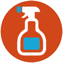

<p align="center">

</p>
# Clickbait Cleaner 🪝🧹
[](https://github.com/wrongpixels/clickbait-cleaner/releases/latest)

### **News, but without the noise.**


Block articles containing keywords you don't want to see. Works on most news sites!

----

### Why I made this

Well, because I'm tired of scrolling past clickbait, rage-bait, and some influencer drama when trying to read the news.

This extension lets you hide articles containing specific words or phrases, so you can avoid reading the tons of filler you don't really care about.

### ✅ What it does

Clickbait Cleaner scans pages for `<article>` elements and hides any that contain keywords from your blocklist.

You can add keywords in two ways:
- **Block Everywhere**: Hide articles with this keyword on all sites
- **Block Here**: Hide articles with this keyword only on the current site


Toggle the extension on/off globally, disable it for specific sites, or add excepcions for your global keywords!

----

### ⚠️ Limitations

This extension works by finding standard HTML `<article>` tags. Most modern news sites use these, but some major outlets like BBC or CNN use custom structures that need to be studied individually.

If it doesn't work on a specific site, just open an issue and I'll look into it to add support for it!

----

### 🚀 Installation
Not published to stores yet! To install manually:

[](https://github.com/wrongpixels/clickbait-cleaner/releases/latest)

1. Go to **[Releases](../../releases)** 
2. Download `clickbait-cleaner-x.x.x.zip` (recommended!) or `clickbait-cleaner-x.x.x.crx`
3. Unzip the folder inside
4. In your browser, go to `chrome://extensions/`, `brave://extensions/` or `edge://extensions/`.
5. Enable **Developer mode** (top right)
6. Click **Load unpacked** and select the folder

Or clone from source:
```bash
git clone https://github.com/wrongpixels/clickbait-cleaner.git
```
Then load the folder in `chrome://extensions/`, `brave://extensions/` or `edge://extensions/`.

And that's it!

----

### 🤝 Feedback

Found a bug or have a suggestion? Open an issue or PR!
